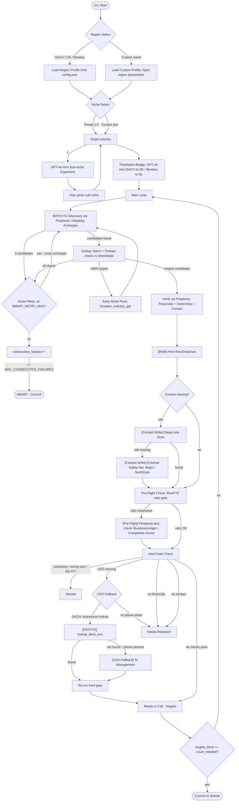

# Developed and maintained by Marc von Gehlen
> Built for DeBruyn Capital | Version 5.9.3

Automated M&A sourcing pipeline that identifies investment-grade SME acquisition targets across Europe. Combines **Perplexity Sonar** (live web research), **GPT-4o-mini** (translation, niche intelligence), and **Google Sheets v4** (structured output).

---

## Table of Contents

1. [System Requirements & Prerequisites](#1-system-requirements--prerequisites)
2. [Step-by-Step Installation Guide](#2-step-by-step-installation-guide)
3. [API Setup & Configuration](#3-api-setup--configuration)
4. [Execution Guide](#4-execution-guide)
5. [Configuration Guide](#5-configuration-guide)
6. [Feature Highlights](#6-feature-highlights)
7. [Pipeline Architecture](#7-pipeline-architecture)
8. [Region Branching Logic](#8-region-branching-logic)
9. [Search Archetypes](#9-search-archetypes)
10. [Hard Gates & Output Tabs](#10-hard-gates--output-tabs)
11. [Smart-Retry & Failure Logic](#11-smart-retry--failure-logic)
12. [Technical Glossary](#12-technical-glossary)

---

## 1. System Requirements & Prerequisites

### Python Version

- **Python 3.11** is required. The pipeline uses `match`/`case` syntax and type hints that are not available in earlier versions.
- Check your version: `python3.11 --version`
- Install via [python.org](https://python.org) or `brew install python@3.11` (macOS)

### Operating System

- macOS (tested), Linux (compatible), Windows (not tested — paths may require adjustment)
- Git must be installed: `git --version`

### Access Required

Before you begin, obtain the following from your supervisor:

| Credential | Where to get it |
|---|---|
| Perplexity API key (`pplx-...`) | Perplexity API dashboard |
| OpenAI API key (`sk-...`) | OpenAI platform dashboard |
| Google Cloud credentials JSON | Google Cloud Console (see Section 3) |
| Target Google Spreadsheet ID | From the spreadsheet URL |

---

## 2. Step-by-Step Installation Guide

### Step 1 — Clone the repository

```bash
git clone <repository-url>
cd "DeBruyn Capital"
```

### Step 2 — Create the virtual environment

```bash
python3.11 -m venv .venv
```

### Step 3 — Activate the virtual environment

```bash
source .venv/bin/activate
```

Your terminal prompt will show `(.venv)` when active. You must run this command every time you open a new terminal session.

### Step 4 — Install dependencies

```bash
pip install -r requirements.txt
```

### Step 5 — Create your `.env` file

Copy the example file and populate it with your credentials:

```bash
cp .env.example .env
```

Then edit `.env` with your actual API keys and gate thresholds (see [Section 3](#3-api-setup--configuration) and [Section 5](#5-configuration-guide)).

### Step 6 — Place Google credentials

Copy your `credentials.json` (Google OAuth client secret) into the project root directory. See [Section 3](#3-api-setup--configuration) for how to obtain this file.

---

## 3. API Setup & Configuration

### Google Sheets API

The pipeline writes results to a Google Spreadsheet using OAuth 2.0. One-time setup:

1. Go to the [Google Cloud Console](https://console.cloud.google.com/)
2. Create a new project (or select an existing one)
3. Enable the **Google Sheets API** under *APIs & Services → Library*
4. Go to *APIs & Services → Credentials* and click **Create Credentials → OAuth client ID**
5. Select **Desktop app**, give it a name, and click **Create**
6. Download the JSON file and rename it to `credentials.json`
7. Place `credentials.json` in the project root directory

On **first run**, a browser window will open for Google OAuth authorization. Approve access — this auto-generates `token.json` in the project root, which persists your session. You will not need to re-authenticate unless `token.json` is deleted.

**Startup validation:** If `credentials.json` is missing, the script prints `ERROR: credentials.json not found` and exits cleanly. If the OAuth token is expired and cannot be refreshed, the script automatically falls back to a new browser-based auth flow.

**Important:** Both `credentials.json` and `token.json` are excluded from git via `.gitignore`. Never commit them.

### Perplexity API

1. Sign up at [perplexity.ai](https://perplexity.ai) and navigate to your API settings
2. Generate a new API key (starts with `pplx-`)
3. Add it to your `.env` file:

```env
PERPLEXITY_API_KEY=pplx-YOUR_KEY_HERE
```

**Startup validation:** The pipeline checks for this key immediately on launch. If it is missing or empty, the script prints a clear error message and exits before making any API calls.

### OpenAI API

1. Sign up at [platform.openai.com](https://platform.openai.com)
2. Go to *API Keys* and create a new secret key (starts with `sk-`)
3. Add it to your `.env` file:

```env
OPENAI_API_KEY=sk-YOUR_KEY_HERE
```

OpenAI (GPT-4o-mini) is used for three optional features: sub-niche expansion, query translation, and intelligent niche broadening. If the key is missing or invalid, these features are skipped and the pipeline continues with fallback behaviour.

---

## 4. Execution Guide

### Starting the Pipeline

Activate the virtual environment first, then run:

```bash
source .venv/bin/activate
python src/ma_agents.py
```

### Interactive Prompts

The script will guide you through three questions at startup:

**1. Region selection**

```
Select Target Region:
  1. DACH      (Germany, Austria, Switzerland)
  2. UK        (United Kingdom)
  3. Benelux   (Netherlands, Belgium, Luxembourg)
  OR type a custom region name (e.g. 'France', 'Nordics')

Choose 1-3 or custom name:
```

Enter `1`, `2`, or `3` for a supported region, or type a free-form region name (e.g. `France`, `CEE`, `Nordics`) to use the generic Custom profile.

**2. Niche selection**

```
Select a niche (1-5) or type your own:
  1. Industrial Maintenance  |  2. Safety Inspections
  3. Machine Building        |  4. Water Management
  5. CNC Manufacturing
```

Enter a number to select a preset, or type your own niche (e.g. `fire suppression systems`, `cleanroom construction`).

If OpenAI is configured, you will then be asked:

```
Want AI sub-niche expansion? (y/n):
```

Entering `y` generates 5 more specific sub-niches via GPT-4o-mini. Recommended for new mandates.

**3. Target count**

```
How many 'Ready to Call' targets?
```

Enter a positive integer. The pipeline stops as soon as this number of qualified leads is found and commits all results to Google Sheets.

### Expected Terminal Output

```
BATCH 3 | Need 7 more
  Found 8 real candidates
  SKIP (dup: exact match): Acme GmbH
  [RAW] Rev=8500000 | Emp=45 | Own=inhabergeführt
  [CEO-FIX] Found via Impressum: Dr. Klaus Müller
  -> READY TO CALL ✓ (confidence: verified)
  -> NEEDS RESEARCH: No financial data
  -> REJECTED: Revenue 320000 EUR < min 4000000

COMMITTING TO GOOGLE SHEETS...
  Targets: 10 rows written
  Needs Research: 3 rows written
  Denied: 12 rows written
```

Press `Ctrl+C` at any time to interrupt. All buffered data is committed to Sheets before exit — no results are lost.

---

## 5. Configuration Guide

### `.env` — Financial Gates & API Keys

```env
# API Keys — NEVER commit these to git
PERPLEXITY_API_KEY=pplx-...
OPENAI_API_KEY=sk-...

# Financial Gates (0 = gate disabled)
REV_MIN=4000000        # Minimum revenue in EUR (4M)
REV_MAX=15000000       # Maximum revenue in EUR (15M)
EMP_MIN=20             # Minimum employee count
EMP_MAX=200            # Maximum employee count
REV_PER_EMP_MIN=10000  # Min revenue per employee (EUR)
REV_PER_EMP_MAX=500000 # Max revenue per employee (EUR)

# Ownership & Contact Filters
FORBIDDEN_OWNERSHIP=subsidiary,group,listed,public,konzern,tochter
REQUIRED_ROLES=Geschäftsführer,Managing Director,CEO,Inhaber
```

Setting any gate value to `0` disables that gate entirely.

### `config/config.json` — Sheet Tabs & Prompt Profiles

#### Dynamic Sheet Tab Names

Customize the Google Sheets tab names without changing code:

```json
{
  "sheet_tabs": {
    "targets": "Targets",
    "denied": "Denied",
    "needs_research": "Needs Research"
  }
}
```

Change any value to rename the corresponding tab. The script reads these names at startup and creates the tabs automatically if they do not exist.

**Startup validation:** If `config/config.json` contains a syntax error (malformed JSON), the script prints `ERROR: config.json is malformed` with the exact parse error and exits — no cryptic stack traces.

#### Spreadsheet ID

```json
{
  "SPREADSHEET_ID": "your-spreadsheet-id-here"
}
```

Find this in your Google Sheets URL: `https://docs.google.com/spreadsheets/d/SPREADSHEET_ID/edit`

#### Region Prompt Profiles

Each region key (`DACH`, `UK`, `Benelux`, `Custom`) contains a full prompt stack:

```json
"DACH": {
  "discovery": {
    "search_archetypes": [ ... ],
    "niche_suggestions": { "1": "...", "5": "..." },
    "system": "...",
    "user_template": "..."
  },
  "verify": {
    "system": "...",
    "user_template": "..."
  },
  "preflight": {
    "system": "...",
    "user_template": "..."
  }
}
```

You can modify the `user_template` strings to adjust how Perplexity searches for and verifies companies in each region.

### Security Rules

1. `.env`, `credentials.json`, and `token.json` are listed in `.gitignore`. Verify this before every `git push`.
2. `SPREADSHEET_ID` in `config.json` is committed — it is a non-sensitive identifier, as the sheet itself is protected by Google OAuth.
3. No API keys are logged or printed to the terminal.
4. If an API key is accidentally exposed, rotate it immediately in the respective dashboard and update `.env`.

---

## 6. Feature Highlights

### Auto-Translation & Query Localisation

When searching for companies in DACH or Benelux, a German or Dutch SME often has no English web presence. The pipeline automatically translates the user's niche input before querying Perplexity:

- **DACH:** "CNC Manufacturing" → "CNC-Fertigung" (used in all discovery archetypes)
- **Benelux:** "Water Management" → "Waterbeheer"
- **UK / Custom:** English input is used as-is — no translation needed

This "Translation Bridge" runs via GPT-4o-mini before the main loop. It yields 3–5× more results from Handelsregister, wer-liefert-was.de, and Mittelstand directories compared to equivalent English search terms.

If OpenAI is unavailable, the pipeline falls back to the original English term.

### Standardised Output (Investment Grade)

All data written to Google Sheets follows these enforced output rules:

**Sector/Description — English Only**

The `Sector/Sub-sector` column always contains the English niche term as entered by the user (before localisation). The `Short Description`, `Why Interesting`, and `Risks` fields are explicitly instructed in all Perplexity verify prompts to be written **in English**, regardless of the target country. This ensures the sheet is readable by international stakeholders even when searching DACH or Benelux markets.

**Revenue — Formatted in Millions**

Raw revenue integers from Perplexity (e.g. `8500000`) are automatically formatted before being written to the sheet:

| Raw value | Sheet output |
|---|---|
| `4500000` | `4.5M` |
| `12000000` | `12.0M` |
| `900000` | `0.9M` |
| `NOT FOUND` | `NOT FOUND` |

This makes the `Estimated Revenue (EUR)` column immediately scannable without requiring formula conversion in the spreadsheet.

---

## 7. Pipeline Architecture



---

## 8. Region Branching Logic

| Key | Coverage | Registry used in Verify | Legal form expected |
|---|---|---|---|
| DACH | Germany, Austria, Switzerland | Bundesanzeiger, North Data, Handelsregister | GmbH / KG / AG |
| UK | United Kingdom | Companies House | Ltd / Plc |
| Benelux | Netherlands, Belgium, Luxembourg | KVK / KBO (Crossroads Bank) | B.V. / N.V. / SRL |
| Custom | Any region | National registry (generic) | Independent LLC |

On region selection, `_active_prompts = _config["prompts"][region]` sets the runtime prompt profile. Every subsequent Perplexity call draws exclusively from this profile — switching region means switching the entire prompt stack with zero code changes.

Custom regions inject a `{{region}}` placeholder (e.g. "France") into generic English templates. DACH / UK / Benelux use hardcoded local terminology (Impressum, inhabergeführt, intitle:Kontakt, etc.) appropriate to their markets.

**Input guard:** If the user types a region name that has no matching profile in `config/config.json` (e.g. a typo), the CLI prints the available profile names and re-prompts — no crash, no silent fallback to DACH.

**GEO-FENCE:** Every discovery prompt includes a hard GEO-FENCE instruction that tells Perplexity to immediately discard any company not headquartered in the target region. This operates at the prompt level — not as a post-filter.

---

## 9. Search Archetypes

Each region profile defines **10 rotating search archetypes** in `config.json`. Each archetype provides a different angle for finding SMEs:

| Archetype type | Example (DACH) | Purpose |
|---|---|---|
| Direct niche | `{{industry}} Unternehmen Deutschland` | Broadest sweep |
| Legal form | `{{industry}} GmbH` | Filter to typical SME structure |
| Mittelstand list | `Liste {{industry}} Mittelstand` | Industry directories |
| Specialist | `{{industry}} spezialisierter Anbieter` | Niche players |
| Directory extract | `Extract a list of 10 member companies from...` | Association/registry lists |
| Trade show | `List the 10 most prominent Mittelstand exhibitors...` | Event-verified companies |
| Succession | `{{industry}} Nachfolge Unternehmensverkauf` | Owner-exit signals |
| Contract mfg | `{{industry}} Lohnfertigung Auftragsfertigung` | B2B production angle |
| Supply chain | `{{industry}} Zulieferer Hersteller Anlagenlieferant` | Upstream specialists |
| OEM/integrator | `{{industry}} Technologiepartner OEM Systemintegrator` | Technology partners |

`batch_num % len(archetypes)` rotates through the list. On Smart-Retry, `batch_num` is jumped forward by `len(archetypes) // 2` to force a different archetype on the next call.

---

## 10. Hard Gates & Output Tabs

### Hard Gate Logic

All thresholds are loaded from `.env`. A threshold of `0` disables that gate.

| Gate | Type | Action |
|---|---|---|
| `parent_revenue_eur > 100M` | Hard reject | → Denied ("Ghost SME") |
| Subsidiary ownership + named parent | Hard reject | → Denied |
| `revenue < REV_MIN` or `> REV_MAX` | Hard reject | → Denied |
| `employees < EMP_MIN` or `> EMP_MAX` | Hard reject | → Denied |
| `Rev/FTE < REV_PER_EMP_MIN` or `> REV_PER_EMP_MAX` | Hard reject | → Denied |
| `ownership_type` in FORBIDDEN_OWNERSHIP | Hard reject | → Denied |
| AI `fit_verdict = NO FIT` | Hard reject | → Denied |
| CEO name missing | Soft gate | → Needs Research |
| Email AND phone missing | Soft gate | → Needs Research |
| Revenue AND employees both missing | Soft gate | → Needs Research |
| All checks pass | Pass | → Ready to Call |

### Output Tabs

| Tab | Contents | When a row lands here |
|---|---|---|
| **Targets** | Ready to Call — passed all hard gates | All gates pass, CEO + contact present |
| **Needs Research** | Financially qualified but missing data | Soft gate triggered (CEO, contact, or financials missing) |
| **Denied** | Rejected — failed hard gates | Wrong size, subsidiary, bad fit verdict |

**Columns in every tab:**
Company Name · Country · Sector/Sub-sector · Website · Short Description · Why Interesting · Risks · Estimated Revenue (EUR) · Employee Count (Est.) · CEO/Founder Name · CEO Email · CEO Phone · Status · Date Added · Notes · Quellen / Links

Data is buffered in memory and written in a **single batch API call** at session end (or on Ctrl+C). This minimises Google Sheets API quota usage.

---

## 11. Smart-Retry & Failure Logic

```
consecutive_failures  — counts batches with zero useful results after Smart-Retry is exhausted
smart_retry           — counts archetype-jump retries within a failure sequence
display_batch         — monotonically increasing display counter (1, 2, 3...)
batch_num             — internal archetype rotation index (can jump forward)
```

| Event | Action |
|---|---|
| Zero candidates from Perplexity | `smart_retry++`; if ≤ SMART_RETRY_MAX: jump archetype by `n//2` |
| All candidates are dupes | `smart_retry++`; same jump logic |
| >80% dupes in batch | Early Niche Pivot (broaden immediately) |
| Batch produces zero useful results after verify | `smart_retry++`; archetype jump |
| `smart_retry >= SMART_RETRY_MAX` | `consecutive_failures++`; reset `smart_retry` |
| `consecutive_failures >= MAX_CONSECUTIVE_FAILURES` (5) | ABORT; commit buffer |
| 3 consecutive failures, niche not yet broadened | Auto-broaden via GPT-4o-mini |

---

## 12. Technical Glossary

### `[RAW]`
```
[RAW] Rev=8500000 | Emp=45 | Own=inhabergeführt | Parent=none
```
Printed immediately after `verify_company()` returns. Shows raw financial values from Perplexity before any gate checks. Useful for spotting hallucinations (e.g. `Rev=8500000000` instead of `8500000`) or missing data.

### `[Contact-Strike]`
```
[Contact-Strike] Deep-link scan...
[Contact-Strike] External safety-net search...
```
Fires when verify returns no email **and** no phone. Two escalating passes run automatically:
1. **Deep-Link-Scan** — targeted Perplexity call visiting `/kontakt`, `/impressum`, `/about`
2. **External Safety-Net** — searches Google Maps, Yelp, North Data, and national registries

### `[Pre-Flight]`
```
[PRE-FLIGHT] Rev/FTE=2,800,000€ suspicious — fact-checking...
[PRE-FLIGHT] Corrected: revenue corrected from 280M to 2.8M
```
Fires when Rev/FTE falls outside the 30k–500k EUR range. An additional Perplexity call retrieves the authoritative figure from Bundesanzeiger / Companies House / KVK.

### `[CEO-FIX]`
```
[CEO-FIX] Found via Impressum: Dr. Klaus Müller
```
**DACH-only.** Fires when the initial verify returns no CEO name. A second targeted Perplexity call searches `site:<website> intitle:Impressum` for the verbatim `Geschäftsführer:` line (`lookup_dach_ceo`). If found, the hard gate is re-evaluated immediately.

### `[CEO-Fallback]`
```
[CEO-Fallback] Set to 'To Management'
```
**All regions.** Fires when CEO is still missing after `[CEO-FIX]` (or for non-DACH regions), but a **phone number is available**. `ceo_name` is set to `"To Management"` and the company is promoted to "Ready to Call". If no phone is available either, the lead stays in "Needs Research".

---

## Additional Documentation

- [Intern Handover Guide](docs/HANDOVER.md) — operational runbook for day-to-day use
- [V6.0 Strategy Report](docs/Strategy_Report.md) — Hybrid Verification roadmap (not yet implemented)
